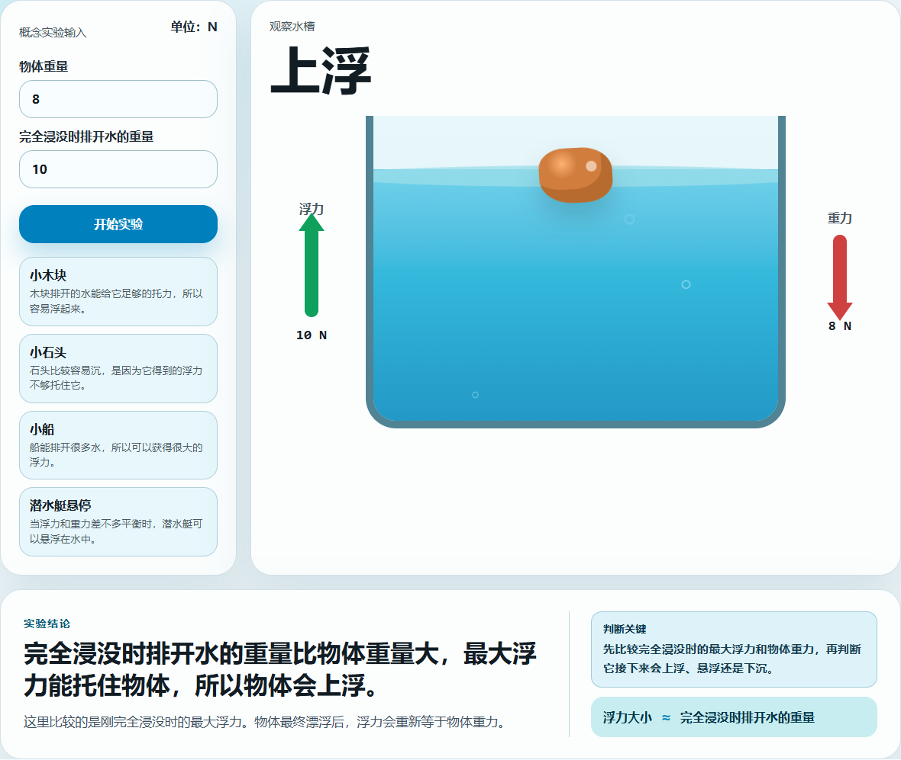
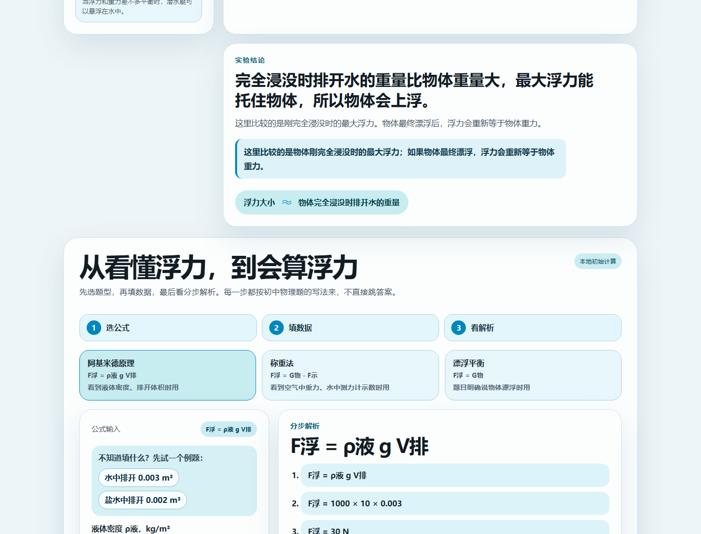
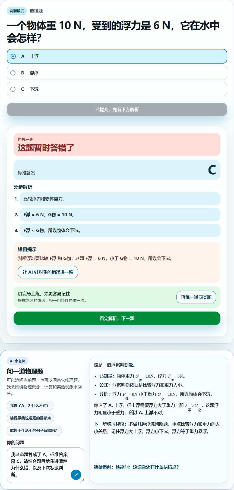
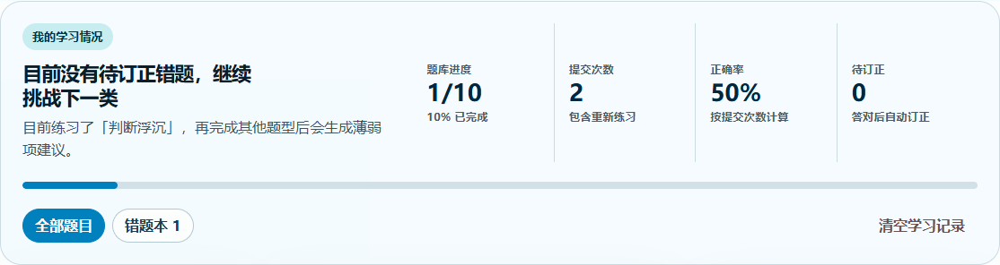
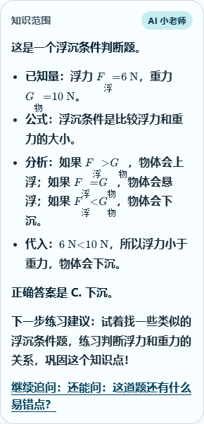

# 浮不浮实验室 Float or Not Lab

一个面向小学高年级和初中生的浮力交互学习工具。它把「浮力为什么能托住物体」拆成概念实验、公式计算、真实题训练、AI 小老师和错题订正五个环节，让学生从看懂现象到能做题，再看到自己的学习进步。

> 核心目标：让学生明白物体能不能浮起来，不是只看它重不重，而是看浮力能不能托住它。

## 项目截图

### 1. 概念实验：看见上浮、悬浮、下沉



### 2. 公式实验室：从现象过渡到计算



### 3. 真实题训练 + AI 小老师



### 4. 学习数据与错题订正



### 5. AI 小老师数学公式排版



## 项目能做什么

### 概念实验

学生输入：

- 物体重量，单位 `N`
- 物体完全浸没时排开水的重量，单位 `N`

系统会判断物体之后的运动趋势：

| 比较关系 | 结果 | 学生能看到 |
| --- | --- | --- |
| 最大浮力 > 重力 | 上浮 | 物体浮到水面，浮力箭头更长 |
| 最大浮力 ≈ 重力 | 悬浮 | 物体停在水中间，两个力接近平衡 |
| 最大浮力 < 重力 | 下沉 | 物体沉到底部，重力箭头更长 |

这里比较的是「物体刚完全浸没时的最大浮力」。如果物体最终漂浮，浮力会重新等于物体重力。

### 公式实验室

支持初中常见的三类浮力公式：

| 题型 | 公式 | 什么时候用 |
| --- | --- | --- |
| 阿基米德原理 | `F浮 = ρ液 g V排` | 题目给液体密度、排开体积 |
| 称重法 | `F浮 = G物 - F示` | 题目给空气中重力和水中测力计示数 |
| 漂浮平衡 | `F浮 = G物` | 题目明确说物体漂浮 |

每次计算都会展示：

1. 使用公式
2. 数字代入过程
3. 最终结果
4. 一句适合初中生的解释

### 真实题训练

内置 10 道初中浮力题，覆盖：

- 判断浮沉
- 称重法求浮力
- 阿基米德公式
- 漂浮平衡
- 轮船、潜水艇等生活应用

学生提交答案后会看到：

- 正误反馈
- 标准答案
- 分步解析
- 动态错因提示

例如阿基米德题正确答案是 `30 N`，学生答成 `3` 时，系统会提示可能漏乘了 `g`，而不是只显示一个固定错误说明。

练习结果会保存在当前浏览器中，不需要登录：

- 展示已完成题数、提交次数和正确率
- 根据答题数据提示需要优先加强的题型
- 曾经答错的题自动进入错题本
- 错题重新答对后自动标记为「已订正」
- 刷新页面后学习记录仍然保留，也可以手动清空

### AI 小老师

AI 小老师用于补充讲解，不替代标准答案。

能力：

- 答错后针对当前错误换一种说法解释
- 支持直接输入物理问题
- 提供快捷追问按钮
- 支持 Server-Sent Events 流式输出
- 支持 Markdown + KaTeX 数学公式排版，兼容 `$...$` 和模型常见的 `\\(...\\)` 输出
- 数学渲染组件按需加载，不增加首页主包体积
- 没有 API Key 时自动降级为本地模板解释

Prompt 约束：只回答物理题目、物理概念、物理计算和物理实验现象相关内容。

答错选择题时，前端会把题干、A/B/C 选项原文、学生所选选项文本、正确答案和标准解析一起传给 AI，避免 AI 只做泛泛解释。

## 技术栈

| 模块 | 技术 |
| --- | --- |
| 前端 | React + Vite + TypeScript |
| 后端 | FastAPI + Pydantic |
| AI | OpenAI-compatible API，支持自定义 `OPENAI_BASE_URL` |
| 流式输出 | Server-Sent Events |
| 部署 | Docker Compose + Nginx + Uvicorn |
| 题库 | 代码内置题库，后续可扩展到 PostgreSQL / Supabase |
| 学习记录 | LocalStorage 保存逐题作答记录、正确率、薄弱题型和订正状态 |

## 快速启动

### 1. 克隆项目

```bash
git clone https://github.com/qd-maker/float-or-not-lab.git
cd float-or-not-lab
```

### 2. 准备环境变量

复制 `.env.example` 为 `.env`：

```bash
cp .env.example .env
```

Windows PowerShell：

```powershell
Copy-Item .env.example .env
```

`.env` 示例：

```bash
ENABLE_AI_TUTOR=true
OPENAI_BASE_URL=https://api.openai.com/v1
OPENAI_MODEL=gpt-4o
OPENAI_API_KEY=
```

说明：

- `OPENAI_API_KEY` 不填也能运行基础功能。
- 如果使用中转站，把 `OPENAI_BASE_URL` 改成中转站的 OpenAI-compatible `/v1` 地址。
- `.env` 已被 `.gitignore` 忽略，不要提交真实密钥。

## 本地开发启动

### 后端

```powershell
cd backend
python -m venv .venv
.venv\Scripts\Activate.ps1
pip install -r requirements.txt
$env:PYTHONPATH=(Get-Location).Path
python -m uvicorn app.main:app --reload --host 0.0.0.0 --port 8000
```

macOS / Linux：

```bash
cd backend
python -m venv .venv
source .venv/bin/activate
pip install -r requirements.txt
export PYTHONPATH=$(pwd)
python -m uvicorn app.main:app --reload --host 0.0.0.0 --port 8000
```

健康检查：

```bash
curl http://localhost:8000/health
```

### 前端

另开一个终端：

```bash
cd frontend
npm install
npm run dev
```

打开：

```text
http://localhost:5173
```

## Docker 部署

Docker 方式更接近生产部署：前端先构建成静态文件，再由 Nginx 托管；浏览器请求 `/api/...` 时由 Nginx 转发给 FastAPI。

```bash
docker compose up --build
```

访问：

```text
前端：http://localhost:5173
后端：http://localhost:8000
健康检查：http://localhost:5173/health
```

Windows 下运行 Docker Desktop 需要开启虚拟化 / WSL 2。如果本机为了 eNSP 等软件关闭了虚拟化，可以先使用上面的本地开发启动方式。

更完整的服务器部署步骤见：[docs/deployment-guide.md](docs/deployment-guide.md)。

## API 概览

| 接口 | 作用 |
| --- | --- |
| `GET /health` | 健康检查 |
| `POST /api/buoyancy/calculate` | 判断上浮、悬浮、下沉 |
| `POST /api/buoyancy/formula/calculate` | 公式计算和分步解析 |
| `GET /api/practice/questions` | 获取内置题库 |
| `POST /api/practice/submit` | 提交答案并返回错因提示 |
| `POST /api/ai/explain-mistake` | AI 错因解释 |
| `POST /api/ai/ask` | AI 普通问答 |
| `POST /api/ai/ask/stream` | AI 流式问答 |

详细接口见：[docs/api-contract.md](docs/api-contract.md)。

## 推荐演示路径

1. 在概念实验区输入 `8 N` 和 `10 N`，观察物体上浮。
2. 改成 `10 N` 和 `6 N`，观察物体下沉。
3. 到公式实验室选择「阿基米德原理」，计算 `1000 × 10 × 0.003 = 30 N`。
4. 到真实题训练区故意答错一道题，查看标准解析和错因提示。
5. 点击「让 AI 针对我的错误讲一遍」，观察 AI 小老师流式解释。
6. 练习区会自动记录本机已练题数、正确率和错题数量，可随时清空。

完整讲解脚本见：[docs/demo-script.md](docs/demo-script.md)。

## 项目结构

```text
float-or-not-lab/
├─ backend/                    # FastAPI 后端
│  ├─ app/
│  └─ tests/
├─ frontend/                   # React 前端
│  ├─ src/
│  └─ nginx.conf
├─ docs/
│  ├─ images/                  # README 截图
│  ├─ api-contract.md
│  ├─ deployment-guide.md
│  ├─ demo-script.md
│  └─ project-summary.md
├─ docker-compose.yml
├─ PRODUCT.md
├─ DESIGN.md
└─ README.md
```

## 测试与验证

后端测试：

```bash
cd backend
$env:PYTHONPATH=(Get-Location).Path
.venv\Scripts\python.exe -m pytest tests -q
```

前端构建：

```bash
cd frontend
npm run build
```

Docker 配置检查：

```bash
docker compose config
```

## 项目文档

- [API Contract](docs/api-contract.md)
- [部署说明](docs/deployment-guide.md)
- [演示脚本](docs/demo-script.md)
- [项目总结](docs/project-summary.md)
- [AI 协作过程记录](docs/ai-collaboration-notes.md)

## 后续可扩展方向

- 增加错题记录和正确率统计
- 让 AI 根据错因生成相似变式题
- 接入 Supabase / PostgreSQL 保存题库和答题记录
- 增加教师视角，查看学生常错题型
- 扩展更多初中物理实验，如压强、杠杆、摩擦力
